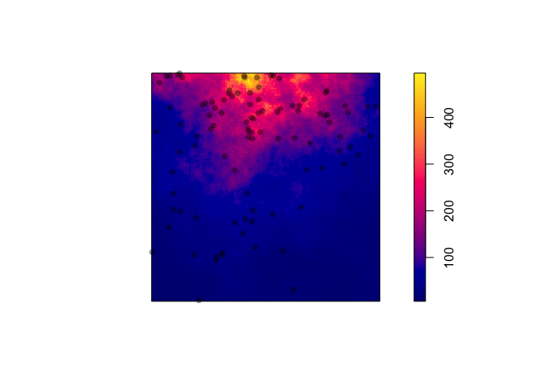
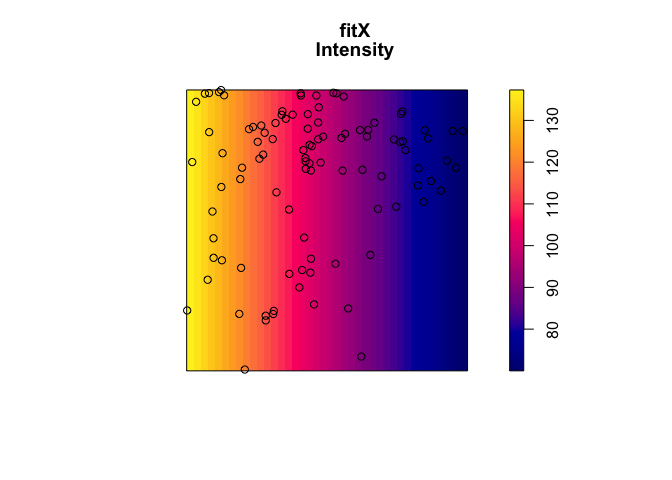
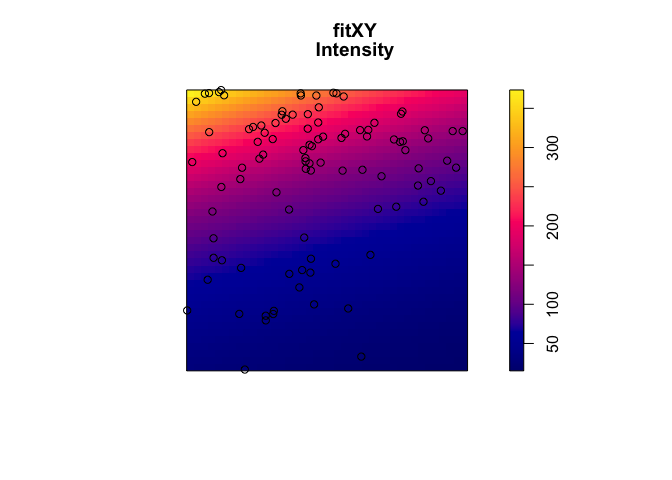
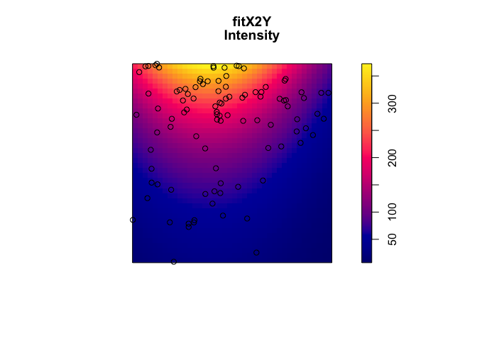
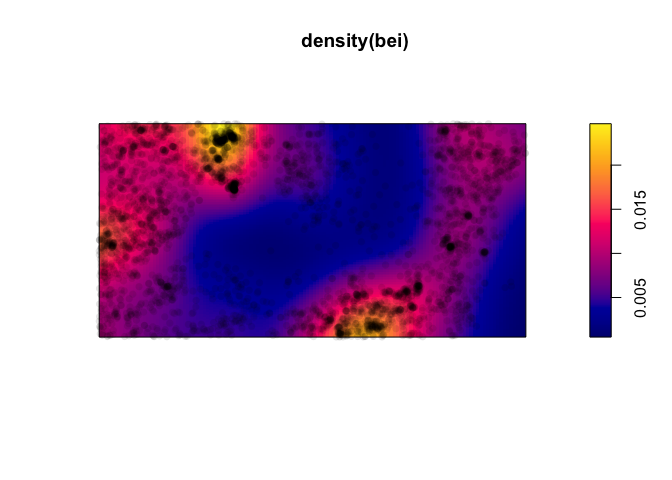
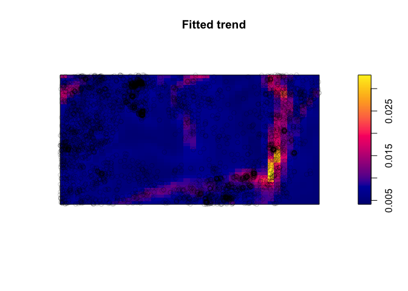
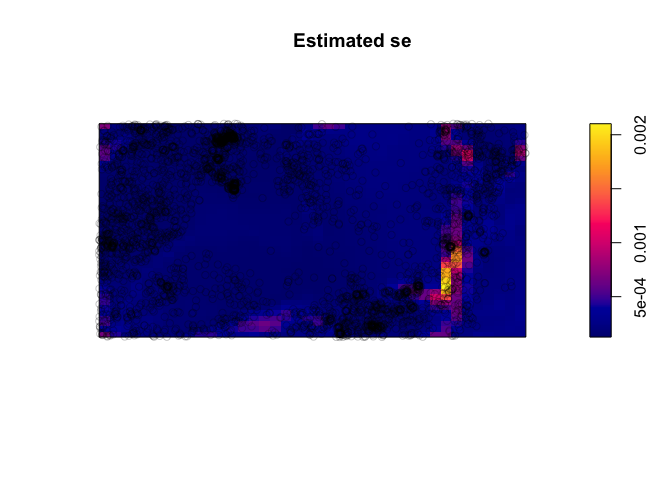
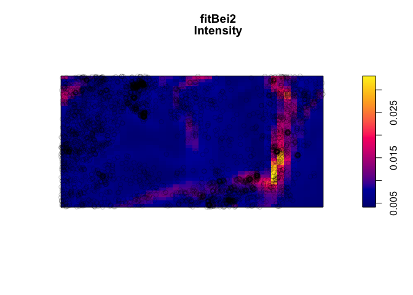

LGCP Demo
================

#### Simulate and visualize LGCP

``` r
m <- as.im(function(x, y){2 + 3*x + 3*y - 3* x^2}, W=owin())
X <- rLGCP("exp", m, var=0.1, scale =0.25)
plot(attr(X, "Lambda"), main = '')
points(X, col = rgb(0,0,0,.4), pch =16)
```

<!-- -->

#### Fit LGCP

Note the plotting function separates the mean intensity and the error
structure from the GP

``` r
fitX <- kppm(X ~ x, "LGCP")
fitX
```

    ## Inhomogeneous Cox point process model
    ## Fitted to point pattern dataset 'X'
    ## Fitted by minimum contrast
    ##  Summary statistic: inhomogeneous K-function
    ## 
    ## Log intensity:  ~x
    ## 
    ## Fitted trend coefficients:
    ## (Intercept)           x 
    ##    4.930759   -0.690791 
    ## 
    ## Cox model: log-Gaussian Cox process
    ##  Covariance model: exponential
    ## Fitted covariance parameters:
    ##       var     scale 
    ## 0.7147553 0.3415939 
    ## Fitted mean of log of random intensity: [pixel image]

``` r
plot(fitX, what = 'intensity')
```

<!-- -->

``` r
fitXY <- kppm(X ~ x + y, "LGCP")
fitXY
```

    ## Inhomogeneous Cox point process model
    ## Fitted to point pattern dataset 'X'
    ## Fitted by minimum contrast
    ##  Summary statistic: inhomogeneous K-function
    ## 
    ## Log intensity:  ~x + y
    ## 
    ## Fitted trend coefficients:
    ## (Intercept)           x           y 
    ##   3.3617138  -0.6894577   2.6021946 
    ## 
    ## Cox model: log-Gaussian Cox process
    ##  Covariance model: exponential
    ## Fitted covariance parameters:
    ##        var      scale 
    ## 0.74747973 0.07795649 
    ## Fitted mean of log of random intensity: [pixel image]

``` r
plot(fitXY, what = 'intensity')
```

<!-- -->

``` r
fitX2Y <- kppm(X ~ polynom(x,2) + y , "LGCP")
fitX2Y
```

    ## Inhomogeneous Cox point process model
    ## Fitted to point pattern dataset 'X'
    ## Fitted by minimum contrast
    ##  Summary statistic: inhomogeneous K-function
    ## 
    ## Log intensity:  ~x + I(x^2) + y
    ## 
    ## Fitted trend coefficients:
    ## (Intercept)           x      I(x^2)           y 
    ##    2.766959    3.022410   -3.924234    2.603791 
    ## 
    ## Cox model: log-Gaussian Cox process
    ##  Covariance model: exponential
    ## Fitted covariance parameters:
    ##        var      scale 
    ## 0.49302416 0.06873786 
    ## Fitted mean of log of random intensity: [pixel image]

``` r
plot(fitX2Y, what = 'intensity')
```

<!-- -->

#### BEI Dataset

Here is a KDE estimate of the surface intensity

``` r
plot(density(bei))
points(bei, col = rgb(0,0,0,.1), pch =16)
```

<!-- -->

### interaction with elevation and gradient

``` r
fitBei <- ppm(bei ~ elev * grad , data=bei.extra)
fitBei
```

    ## Nonstationary Poisson process
    ## 
    ## Log intensity:  ~elev * grad
    ## 
    ## Fitted trend coefficients:
    ##   (Intercept)          elev          grad     elev:grad 
    ##  -4.403426761  -0.007024363 -36.500458701   0.292813497 
    ## 
    ##                  Estimate        S.E.      CI95.lo       CI95.hi Ztest
    ## (Intercept)  -4.403426761 0.614763210  -5.60834051  -3.198513010   ***
    ## elev         -0.007024363 0.004192219  -0.01524096   0.001192235      
    ## grad        -36.500458701 5.261456400 -46.81272375 -26.188193651   ***
    ## elev:grad     0.292813497 0.036257125   0.22175084   0.363876155   ***
    ##                  Zval
    ## (Intercept) -7.162801
    ## elev        -1.675572
    ## grad        -6.937330
    ## elev:grad    8.076026

``` r
plot(fitBei, what = 'intensity')
```

<!-- --><!-- -->

### LGCP fit (kind of…)

``` r
fitBei2 <- kppm(bei ~ elev * grad , "LGCP", data=bei.extra)
fitBei2
```

    ## Inhomogeneous Cox point process model
    ## Fitted to point pattern dataset 'bei'
    ## Fitted by minimum contrast
    ##  Summary statistic: inhomogeneous K-function
    ## 
    ## Log intensity:  ~elev * grad
    ## 
    ## Fitted trend coefficients:
    ##   (Intercept)          elev          grad     elev:grad 
    ##  -4.403426761  -0.007024363 -36.500458701   0.292813497 
    ## 
    ## Cox model: log-Gaussian Cox process
    ##  Covariance model: exponential
    ## Fitted covariance parameters:
    ##       var     scale 
    ##  1.609714 45.955501 
    ## Fitted mean of log of random intensity: [pixel image]

``` r
plot(fitBei2, what = 'intensity')
```

<!-- -->

More comprehensive model fitting, may require approximate methods, and
in particular Inverse Nested Laplace Approximations (INLA). See the
following R packages for more details:

  - `INLA`
  - `inlabru`
  - `lgcp`
